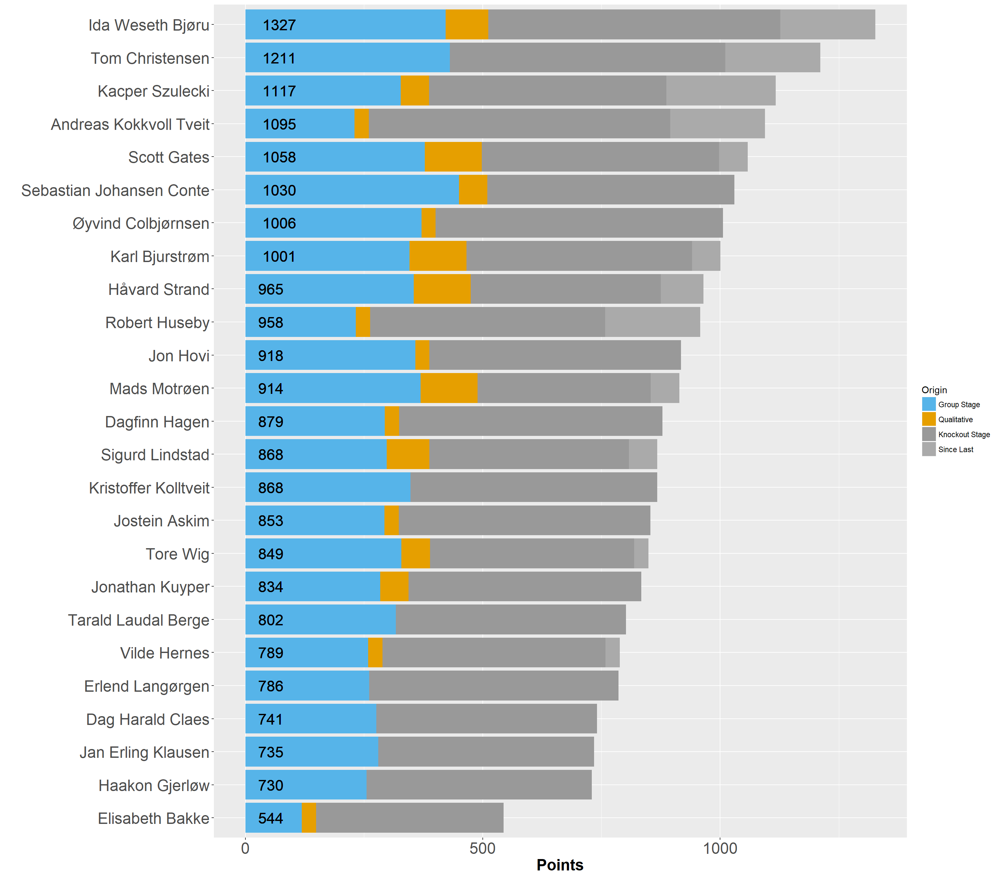

## Welcome to the STV Euro2021 competiton

This blog will serve updates throughout the competition. I hope to be able to post an update after every day. The main difference this year is that updates will be posted as new posts rather than updating the increasingly long single page. 

There will also be a discussion thread at the bottom of each page.

Three years ago, Ida won what was a very close race almost to the end. We had a total of 25 participants, which all did above average. 




```{r intro, echo=FALSE, message=FALSE , warning=FALSE}

library(tidyverse)
library(igraph)

cormat <- tbl_df(read.csv("..\\csv\\cormat.csv", sep=";", header = FALSE, stringsAsFactors=FALSE))

cormat$V4 <- ifelse(cormat$V3 > 0.55, 1, 0)

cormat <- rename(cormat, "Korr" = "V3")

el <- cormat %>% filter(V4 == 1) %>% filter(V1 != V2)
el <- el[1:2]

plot.igraph(graph.edgelist(as.matrix(el)), layout = layout_with_fr(graph.edgelist(as.matrix(el))), vertex.label.cex=2)

```